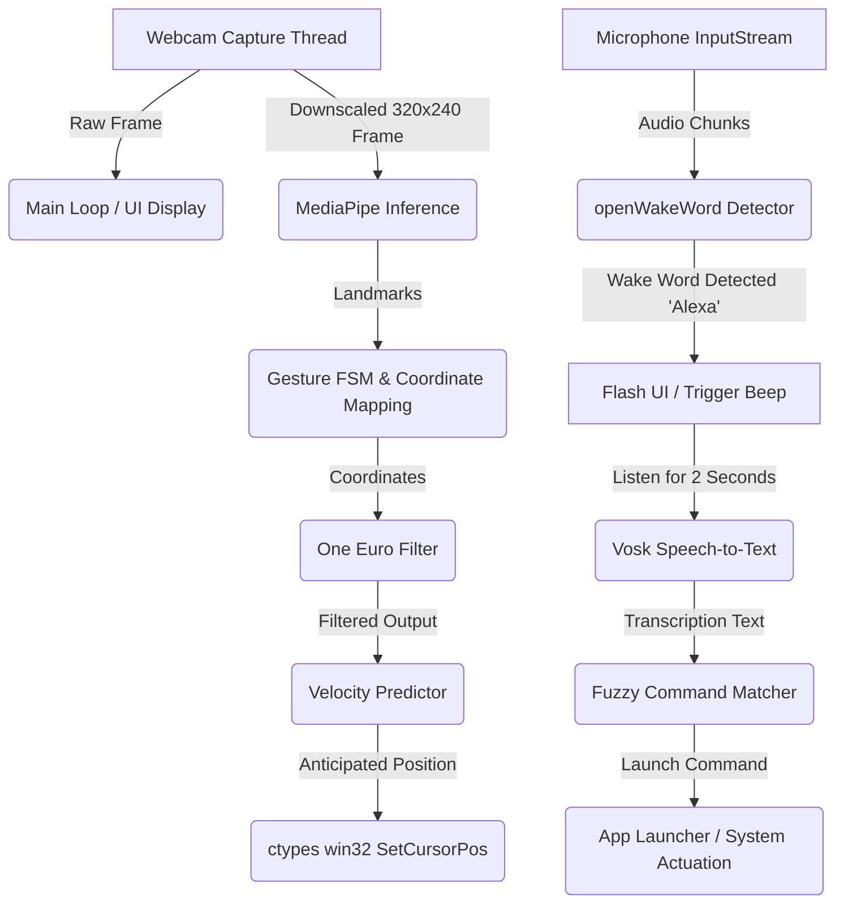

# 🖐️ Look-N-Act: Gesture Cursor & Voice Command Controller

A state-of-the-art, high-performance, completely local desktop automation assistant. It combines real-time **computer vision hand-gesture tracking** with **offline speech recognition** to provide hands-free control of your Windows desktop (cursor navigation, clicking, scrolling, system operations, and application launching via voice).

---

## 🛠️ Tech Stack

*   **Language**: Python 3.13
*   **Computer Vision & Tracking**: MediaPipe Tasks API (Hand Landmarker Model) & OpenCV
*   **Audio Capture & DSP**: `sounddevice` (asynchronous input stream callbacks) & NumPy (RMS volume metering and PCM conversion)
*   **Wake Word Detection**: `openwakeword` (ONNX Runtime engine executing local acoustic models)
*   **Offline Speech Recognition**: `vosk` API (Kaldi-based lightweight offline speech-to-text model)
*   **Low-Latency OS Actuation**: Win32 API (`SetCursorPos`, `mouse_event`) invoked via Python's built-in `ctypes` (6.7x faster than standard library solutions like `pynput` / `pyautogui`, taking only ~1.8 microseconds)
*   **Utility & Benchmarking**: `pynput` (used for background benchmarking comparison) and `difflib` (for fuzzy command matching)

---

## 🧠 Architecture & Key Features



1.  **Threaded Camera Input (`ThreadedCamera`)**:
    Standard OpenCV camera readers block the main thread. We capture frames in a dedicated background daemon thread, reducing raw frame read overhead in the main loop to **$<1$ ms**.
2.  **Dual-Resolution Processing**:
    High-resolution frames are captured for the display UI window, while downscaled frames (`320x240`) are fed to MediaPipe for hand landmark extraction. This minimizes latency and keeps CPU utilization low.
3.  **One Euro Filter Smoothing**:
    We implement an adaptive first-order low-pass filter in [one_euro_filter.py](one_euro_filter.py) that adjusts its cutoff frequency dynamically based on hand speed. This eliminates mouse jitter at rest without introducing lag during quick swipes.
4.  **Velocity-Based Predictive Positioning**:
    To counter pipeline delays (camera capture + inference + display buffers), the system tracks velocity over a sliding window and projects cursor coordinates ahead by `60ms` (configurable).
5.  **Pinch-to-Click Finite State Machine (FSM)**:
    A robust FSM (`IDLE` ➡️ `PINCH_STARTED` ➡️ `PINCH_CONFIRMED` ➡️ `RELEASED`) with a `100ms` debounce threshold prevents accidental click release. It includes visual feedback lines and safety release loops if tracking drops mid-click.
6.  **Pinch-to-Scroll Joystick**:
    By pinching the secondary hand (Left) inside the Active Zone, you can scroll up and down. Scrolling speed scales dynamically with pinch tightness, and direction is determined by hand displacement from the pinch start position.
7.  **Fully Offline Voice Engine**:
    *   **Wake Word**: Uses `openwakeword` to detect `"Alexa"` locally.
    *   **Speech Recognition**: Uses `vosk-model-small-en-us-0.15` to transcribe 2-second voice audio segments locally.
    *   **Fuzzy Matching**: Matches the transcribed text against a fixed dictionary using `difflib.get_close_matches` with a similarity cutoff of `0.6`.
8.  **Automated App Launching**:
    Launches apps from [app_commands.json](app_commands.json) dynamically, supporting standard paths, custom locations, and UWP Microsoft Store apps via URI schemes (`whatsapp:`).

---

## 🎮 How to Control

### 🖐️ Gesture Reference

| Action | Active Hand | Gesture Description |
| :--- | :--- | :--- |
| **Move Cursor** | Primary (Right Hand) | Point with your index finger and move it within the Cyan active boundary box. |
| **Left Click / Drag** | Primary (Right Hand) | Pinch your index finger and thumb together. Hold the pinch to drag. |
| **Right Click Modifier** | Secondary (Left Hand) | Pinch your index finger and thumb together. While held, all clicks from the primary hand trigger right-clicks. |
| **Continuous Scroll** | Secondary (Left Hand) | Pinch index finger and thumb. Move your hand up/down relative to the start height to scroll. Pinch tighter to scroll faster. |

### 🗣️ Voice Commands Dictionary

Wake the system by saying **"Alexa"** (an visual white/yellow border flash and beep sound will trigger), then speak one of these commands within 25 seconds:

*   **App Launchers**:
    *   `"one"` ➡️ Launches File Explorer (`explorer.exe`)
    *   `"two"` ➡️ Launches WhatsApp (UWP Store app or fallback standalone launcher)
    *   `"three"` ➡️ Launches Brave Browser
    *   `"vscode"` ➡️ Launches Visual Studio Code
    *   `"calculator"` ➡️ Launches Windows Calculator
*   **System Controls**:
    *   `"click"` ➡️ Simulates left click
    *   `"right click"` ➡️ Simulates right click
    *   `"double click"` ➡️ Simulates double click
    *   `"scroll up"` ➡️ Scrolls page up
    *   `"scroll down"` ➡️ Scrolls page down
    *   `"screenshot"` ➡️ Takes a full-screen screenshot and saves it as a timestamped PNG
*   **Engine Commands**:
    *   `"stop listening"` / `"start listening"` ➡️ Toggles speech recognition processing

---

## 🚀 Getting Started

### Prerequisites
*   Windows 10/11
*   Python 3.13 (or 3.10+)
*   A working webcam and microphone

### Installation

1.  **Clone or navigate to the project directory**:
    ```cmd
    cd LookNAct
    ```

2.  **Activate the Python Virtual Environment**:
    *   **PowerShell**:
        ```powershell
        .\venv\Scripts\Activate.ps1
        ```
    *   **Command Prompt**:
        ```cmd
        venv\Scripts\activate
        ```

3.  **Install dependencies**:
    ```cmd
    pip install -r requirements.txt
    ```
    *Note: If openWakeWord or Vosk is not yet downloaded, the system will auto-download them on first run.*

### Running the Application

Execute the main script:
```cmd
python main.py
```

*   **Keyboard Commands (Focus OpenCV window first)**:
    *   Press **`d`** to toggle the debug trails overlay (Yellow = Raw, Magenta = Smoothed, White = Predicted).
    *   Press **`p`** to toggle predictive positioning.
    *   Press **`q`** to quit the application cleanly.

---

## ⚙️ Configuration & Tuning

All main configurations are declared at the top of [main.py](main.py):

*   **Active Zone Box (`ACTIVE_MARGIN_X` / `ACTIVE_MARGIN_Y`)**: Sets the boundary margins. Decreasing this enlarges the cursor navigation box.
*   **MediaPipe Confidence (`DETECTION_CONFIDENCE` / `TRACKING_CONFIDENCE`)**: Lower these under low-lighting environments to prevent tracking dropouts.
*   **One Euro Filter (`FILTER_MIN_CUTOFF` / `FILTER_BETA`)**:
    *   Decrease `FILTER_MIN_CUTOFF` (e.g., to `0.5`) to reduce jitter when holding the hand still.
    *   Increase `FILTER_BETA` (e.g., to `0.1`) to reduce cursor latency during fast hand movements.
*   **Predictive Horizon (`PREDICTION_HORIZON_MS`)**: Adjusts how far ahead (in milliseconds) the cursor is projected based on hand velocity. Set to `0` to disable prediction entirely.

---

## 🔮 Future Enhancements

1.  **Voice Dictation mode**: Say `"type [text]"` to write out text directly using continuous local speech recognition.
2.  **Macro Customization**: Allow users to map specific gestures (e.g., peace sign, open palm, fist) to complex macro combinations (`Ctrl+C`, `Alt+Tab`, or custom script executions).
3.  **Dynamic Eye-Tracking Fusion**: Combine camera-based gaze estimation to position the mouse cursor roughly where the user is looking, using subtle hand gestures exclusively for micro-adjustments and clicking.
4.  **Cross-Platform Parity**: Integrate MacOS (Quartz/CoreGraphics mouse events) and Linux (`uinput`/`evdev` wrappers) so that the custom ctypes acceleration runs smoothly on all major operating systems.
